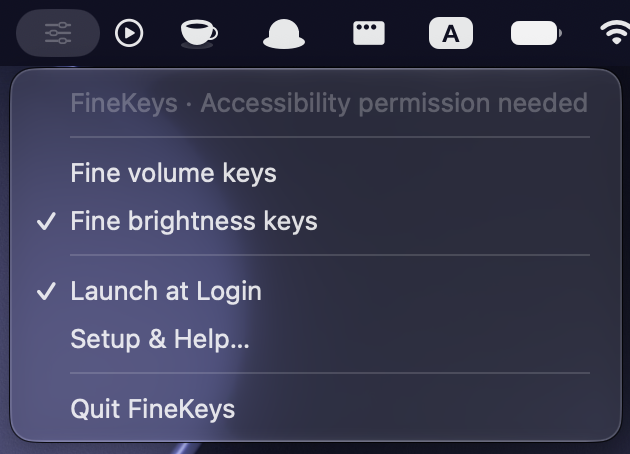

<p align="center">
  
</p>

<h1 align="center">FineKeys</h1>

<p align="center">
  Fine-grained brightness and volume controls from the media keys you already use.
</p>

<p align="center">
  <a href="#install">Install</a> · <a href="#use-finekeys">Usage</a> · <a href="#build-from-source">Build</a> · <a href="#privacy">Privacy</a>
</p>



## What FineKeys does

FineKeys is a lightweight Swift/AppKit menu bar app for people who want smaller brightness and volume changes without holding modifier keys. It intercepts only the supported media-key events and adds macOS’s native fine-step modifiers before macOS handles them.

The app has separate controls for volume keys and display-brightness keys, so either behavior can be enabled independently. Mute, playback, explicit modifier shortcuts, and unrelated media keys retain their normal behavior.

| Capability | Details |
| --- | --- |
| Fine volume steps | Applies to volume up and volume down when enabled. |
| Fine brightness steps | Applies to display brightness up and down when enabled. |
| Independent switches | Turn either group off from the menu to restore normal increments. |
| Menu bar only | Runs as a small status item without a Dock icon. |
| One-time onboarding | Shows setup help once, while keeping help available from the menu. |
| Launch at Login | Optional macOS login-item integration. |

## Install

FineKeys is currently a development project. A future public release should be Developer ID signed and notarized before distribution.

1. Download the release archive when one is available.
2. Drag `FineKeys.app` to `/Applications`.
3. Open FineKeys. Its control appears in the menu bar.
4. FineKeys requests Accessibility access on first launch. If it is not granted, choose **Grant Accessibility Permission…** or **Setup & Help…** from the menu and approve it in System Settings.
5. Press your usual volume or brightness keys to use fine adjustments.

For a locally built development app, macOS may require you to remove and re-add FineKeys in Accessibility after rebuilding it. If launch-at-login approval is pending, FineKeys opens the relevant Login Items settings page.

## Use FineKeys

Open the FineKeys item in the menu bar and choose the controls you want:

| Menu item | Result |
| --- | --- |
| **Fine volume keys** | Enables smaller increments for the volume up and down keys. |
| **Fine brightness keys** | Enables smaller increments for the brightness up and down keys. |
| **Launch at Login** | Starts FineKeys after you sign in to macOS. |
| **Grant Accessibility Permission…** | Appears while access is missing and asks macOS to show the authorization prompt. |
| **Setup & Help…** | Explains setup and opens Accessibility settings. |
| **Retry Key Interception** | Appears after a failed event-tap setup and tries again. |

FineKeys works with the standard media-key row. If your keyboard is configured to use F1–F12 as standard function keys, keep holding **Fn** as you normally would. The controlled display and audio output must support native macOS adjustments.

### Status meanings

| Status | Meaning | What to do |
| --- | --- | --- |
| **Fine adjustments active** | Key interception is working. | Use your normal media keys. |
| **Accessibility permission needed** | macOS has not authorized input monitoring. | Use **Setup & Help…**, then enable FineKeys in Accessibility settings. |
| **Normal adjustments** | Both fine-key options are disabled. | Enable volume or brightness controls from the menu. |
| **Key interception unavailable — Retry** | macOS did not create or enable the event tap. | Choose **Retry Key Interception**; if needed, reopen the app after checking Accessibility access. |

## Privacy

FineKeys processes supported media-key events locally to adjust their modifier flags. It does not record keystrokes, post synthetic key events, send data over the network, include analytics, or use third-party dependencies.

Accessibility access is required because macOS protects global input interception. FineKeys only activates its event tap while at least one fine-key option is enabled.

## Compatibility and limitations

- Requires macOS 13 or later.
- Builds as a universal app for Apple Silicon and Intel Macs.
- External displays and audio devices must support macOS-controlled brightness or volume.
- Other media-key remapping utilities may conflict with FineKeys.
- An active event tap confirms that interception is enabled; physical device behavior still needs validation on the specific Mac, keyboard, display, and audio device.

FineKeys is configured for direct distribution, not the Mac App Store. The current implementation uses an active global event tap and therefore has App Sandbox disabled. See [VALIDATION.md](VALIDATION.md) for the release checklist and distribution gates.

## Build from source

Open `FineKeys.xcodeproj` in Xcode, or run these commands from the repository root:

```sh
./scripts/test.sh
./scripts/package.sh development
```

The test suite exercises the modifier policy and media-event payload preservation without changing your real brightness or volume. The development package is ad-hoc signed and is not suitable for public distribution.

For a release, use a valid Developer ID Application certificate and a Keychain `notarytool` profile:

```sh
export FINEKEYS_SIGN_IDENTITY='Developer ID Application: Your Name (TEAMID)'
export FINEKEYS_NOTARY_PROFILE='your-keychain-profile'
./scripts/package.sh release
```

The release script builds a universal app, applies Hardened Runtime signing, submits the app for notarization, staples the ticket, validates Gatekeeper, and creates the ZIP only after those checks pass.

## Project layout

| Path | Purpose |
| --- | --- |
| `FineKeys/main.swift` | AppKit lifecycle, menu, preferences, setup, and login-item actions. |
| `FineKeys/MediaKeyInterceptor.swift` | Accessibility state, event-tap lifecycle, and media-key transformation. |
| `FineKeys/KeyPolicy.swift` | Pure modifier-selection policy. |
| `Tests/main.swift` | Lightweight executable regression tests. |
| `IconDesign/` | Source icon concepts and the selected refined artwork. |
| `scripts/` | Test and packaging commands. |
| `VALIDATION.md` | Manual validation and release checklist. |

## Contributing

Issues and pull requests are welcome. Before proposing behavior changes, please test on real hardware and describe the macOS version, Mac architecture, keyboard type, display, audio output, and any other utilities that intercept media keys.

## License

This repository does not yet include a license. Until one is added, the code is all rights reserved. If you want to accept contributions or permit reuse, add a license such as [MIT](https://opensource.org/license/mit/).
